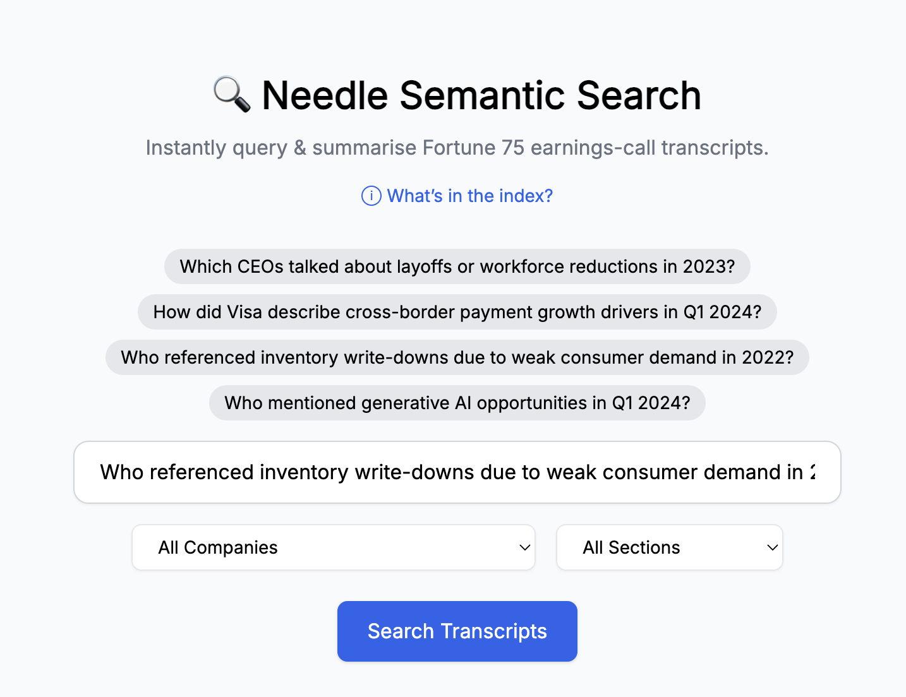

# needle-semantic-search
## [Needle 🪡](https://needle-semantic-search.vercel.app/)
A semantic search engine designed specifically for earnings call transcripts.



## Architecture
### Data ingestion pipeline
The data ingestion pipeline is driven by `/scraper/main.py`, a CLI tool. It supports the following commands:
- `crawl`: The utility looks at `/common/tickers.json`, and pulls transcript URLs from [Motley Fool](https://www.fool.com/). These are written to the local file system.
- `fetch`: The utility looks at the list of URLs to pull, checks whether we have already pulled, and if not saves the HTML to local storage for future ingestion.
- `ingest`: The utility finds eligible saved HTML and pulls it into the ingestion pipeline:
  1. The HTML is parsed via beautiful soup. Text and metadata are extracted into associated chunks, split by speaker in _prepared remarks_, and by back and forth exchange in _question & answer_.
  2. Chunk texts are filtered for filler words, and then sent to the [OpenAI Embeddings API](https://platform.openai.com/docs/guides/embeddings). _API requests are batched in token-aware fashion._
  3. Vector embeddings are combined with document metadata and uploaded to Pinecone (Vector DB). _API requests are batched to minimize network traffic, maximize speed_
- `retry`: Retries failed steps of the pipeline. 
- `refresh_metadata`: If changes have been made to the metadata parsing logic, regenerate the metadata and update existing chunks. _The ~20k chunks are updated asynchronously, reducing process from 40 mins to under 3 mins_.
- `extract_candidates`: Do a bit of data science to determine most common filler words by frequency. We can tweak the frequency threshold to filter out more/less noise within the chunks.
- `regenerate_snippets`: Following the `extract_candidates` process, we can regenerate the snippets.


### App
1. User inputs a search query, complete with optional filters.
2. Needle API (FastAPI server hosted on [Fly.io](https://fly.io/)) receives request and fetches the embeddings of the search query from the same OpenAI API as above.
3. A query is sent to Pinecone, leveraging their `index.query()` method, which also handles metadata filtering.
4. The top k (currently 8) results are wrapped into an LLM query in order to summarize and provide insights.
5. Results are returned (relevant chunks and associated metadata) and displayed to the user.


## Future Improvements
- [x] Improve results presentation: One result per document, not per chunk.
- [x] Semantic summaries: Show users a concise summary of relevant search results, leverage GPT-3.5
- [ ] Analytics/Observability: Implement logging, metrics, gain insight into click through rate.
  - We have logging, but no capture of CTR, no metrics.
- [ ] Automated Data Pipeline: Automate weekly ingestion flow, expand current MVP scope of supported earnings calls.
  - Automation still to come, but CLI tool automates much of the pipeline.

## Running Needle Locally
### Local setup
1. API keys
    1. Sign up for OpenAI, get API key.
    2. Sign up for Pinecone, get API key, index URL.
2. Clone repo
3. Add API keys to `/backend/.env`
    1. `OPENAI_API_KEY`
    2. `PINECONE_DEFAULT_API_KEY`
    3. `PINECONE_HOST_URL`
4. Add symlink to `/notebooks/.env`: (from `/notebooks/`) 
    ```ln -s {{absolute path to /backend/.env}} .env```
5. Create virtual environments, install requirements
    1. (In `/notebooks/` and `/backend`) 
    ```
        virtualenv .venv
        source .venv/bin/activate
        pip install -r requirements.txt
    ```
### Running
#### App
1. Spin up local server (From `/backend`, within virtualenv) 
    1. Either... FastAPI dev
  ```fastapi dev src/main.py```
    2. Or spin up via docker
  ```
    docker build -t needle-backend .
    docker run \
    -p 8000:8000 \
    -e OPENAI_API_KEY={{YOUR KEY HERE}} \
    -e PINECONE_DEFAULT_API_KEY={{YOUR KEY HERE}} \
    -e PINECONE_HOST_URL={{YOUR INDEX URL HERE}} \
    needle-backend
  ```   
2. Spin up front end (from `/frontend`)
    1. `npm install`
    2. Create `.env` file with
    ```VITE_BACKEND_URL=http://localhost:8000```
    3. `npm run dev`
    4. Frontend will be running at `http://localhost:5173`

### Health Check
Verify the backend is running by hitting `http://localhost:8000/healthz`. It returns `{"status": "ok"}`.


## Pre-commit Hook
This repository uses [pre-commit](https://pre-commit.com/) to automatically run
unit tests and linters on directories with staged changes. Install the hook with:

```bash
pre-commit install
```

Before each commit, `pytest` runs for any top-level directory that contains
tests and has staged modifications (e.g. `backend`, `scraper`). When code in
`backend`, `scraper`, `common`, or `setup.py` changes, `black` checks the files.
If the `frontend` directory has modifications, ESLint runs. If none of these
directories have staged changes, the hook exits without running tests or
linters.
