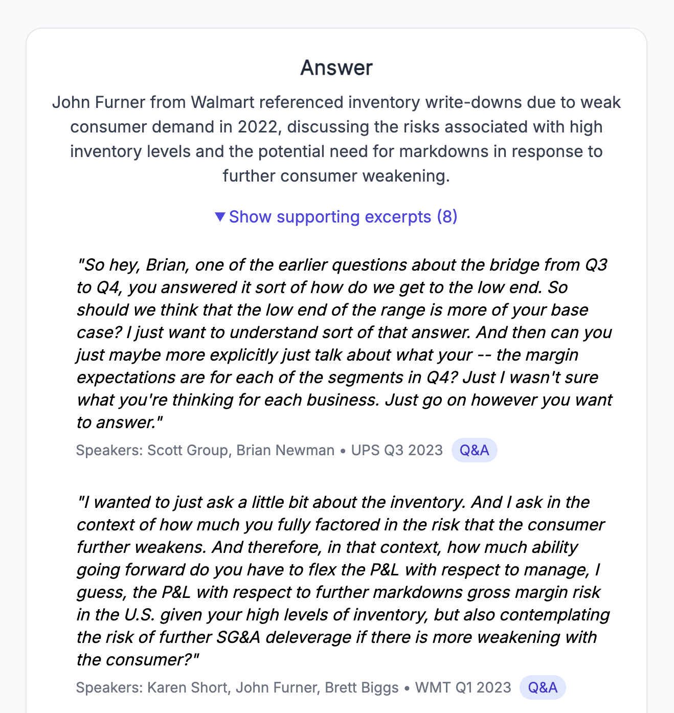

# needle-semantic-search
## [Needle 🪡](https://needle-semantic-search.vercel.app/)
A semantic search engine designed specifically for earnings call transcripts.



## Architecture
### Data ingestion pipeline
[Motley Fool](https://www.fool.com/) transcript URLs are input to a function within the jupyter notebook.
1. Text is extracted from page via beautiful soup.
2. Text is chunked into length 500 strings and sent to the [OpenAI API](https://platform.openai.com/docs/guides/embeddings)
3. Vector embeddings are combined with document metadata and uploaded to Pinecone (Vector DB).


### App
1. User inputs a search query, complete with optional filters.
2. Needle API (FastAPI server hosted on [Fly.io](https://fly.io/)) receives request and fetches the embeddings of the search query from the same OpenAI API as above.
3. A query is sent to Pinecone, leveraging their `index.query()` method, which also handles metadata filtering.
4. Reults are returned (relevant chunks and associated metadata) and displayed to the user.


## Future Improvements
- Improve results presentation: One result per document, not per chunk.
- Semantic summaries: Show users a concise summary of relevant search results, leverage GPT-3.5
- Analytics/Observability: Implement logging, metrics, gain insight into click through rate.
- Automated Data Pipeline: Automate weekly ingestion flow, expand current MVP scope of supported earnings calls.

## Running Needle Locally
### Local setup
1. API keys
    1. Sign up for OpenAI, get API key.
    2. Sign up for Pinecone, get API key, index URL.
2. Clone repo
3. Add API keys to `/backend/.env`
    1. `OPENAI_API_KEY`
    2. `PINECONE_DEFAULT_API_KEY`
    3. `PINECONE_HOST_URL`
4. Add symlink to `/notebooks/.env`: (from `/notebooks/`) 
    ```ln -s {{absolute path to /backend/.env}} .env```
5. Create virtual environments, install requirements
    1. (In `/notebooks/` and `/backend`) 
    ```
    virtualenv .venv
    source .venv/bin/activate
    pip install -r requirements.txt
    ```
### Running
#### Data Ingestion
1. Run jupyter notebook sequentially, familiarize yourself with the various steps, functions. Run ad hoc, as needed.
#### App
1. Spin up local server (From `/backend`, within virtualenv) 
    1. Either... FastAPI dev
  ```fastapi dev src/main.py```
    2. Or spin up via docker
  ```
  docker build -t needle-backend .
  docker run \
  -p 8000:8000 \
  -e OPENAI_API_KEY={{YOUR KEY HERE}} \
  -e PINECONE_DEFAULT_API_KEY={{YOUR KEY HERE}} \
  -e PINECONE_HOST_URL={{YOUR INDEX URL HERE}} \
  needle-backend
  ```   
2. Spin up front end (from `/frontend`)
    1. `npm install`
    2. Create `.env` file with
    ```VITE_BACKEND_URL=http://localhost:8000```
    3. `npm run dev`
    4. Frontend will be running at `http://localhost:5173`
